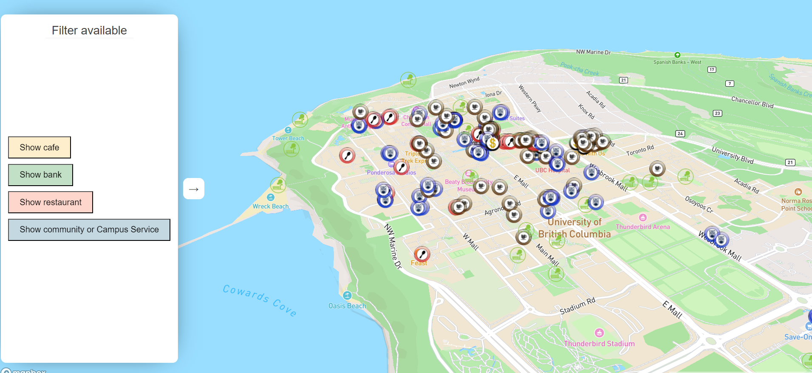

**Image**

**Reflective analysis**

This map is designed for people living near UBC and seeking some certain buildings. I designed this map to help newcomers who may have trouble finding a place to have dinner or other necessities. First, I used special icons to represent different types of facilities. For example, I used a spoon and fork icon for restaurants. Thus, users will easily find where they want to go.I chose the street map as the basemap because it will help users navigate more easily. In my  initial design, The map can change dircetion when the user change the dircection they face. Thus I tilted this map. Finally, I added a sidebar as the Mapbox Tutorial taught, which makes the map looks simple when it collapsed. 

The map is user-friendly. The filter API cannot be used in this case. However, I cannot achieve this because I want to use my own markers. I had to follow a tutorial that adds the mark directly on the map instead of the layer, so the filter API cannot work in this case.

First, I want to complete the filter features so that users can easily remove unwanted makers. Then, I want to create a locator feature that makes it easier for users to find where to go. Finally. I think I may use a light basemap with street geoJSON data, which will highlight the what the uses can walk.

**Thanks**

This map is highly based on the Tutorials from Mapbox.  The features including using custom symbols, popup, sidebar, CSS style, and display properties information  (delated from the final version because I found ). 